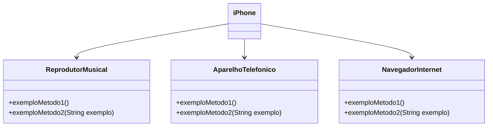
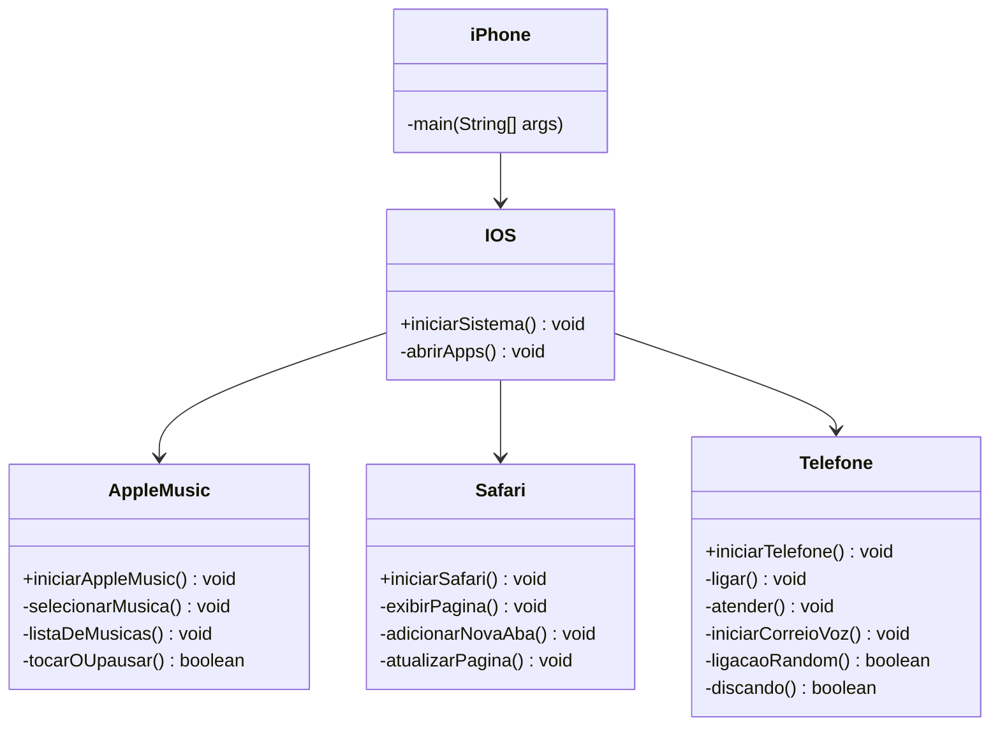

# <h1>Contexto<h1>

Este é um repositório destinado a armazenar o código do desafio proposto pela DIO, no BootCamp de Backend com Java, onde é requerida a criação de um diagrama UML referenciando as funções de um iPhone, neste caso o primeiro deles, lançado em 2007.

🔗 [Lançamento iPhone 2007](https://www.youtube.com/watch?v=9ou608QQRq8)

* Minutos relevantes [ 0:15 - 3:12 ]

\
Além do mais, no desafio, além da criação do diagrama UML, havia, de maneira opcional, o requerimento de implementação em código Java (Linguagem trabalhada no BootCamp).

A propósito, este é como seria o diagrama UML.

\
Durante a diagramação tornou-se notório a necessidade da adição de alguns outros métodos para o funcionamento do código.

Este abaixo, é o diagrama modificado a propósito da resolução do desafio.

